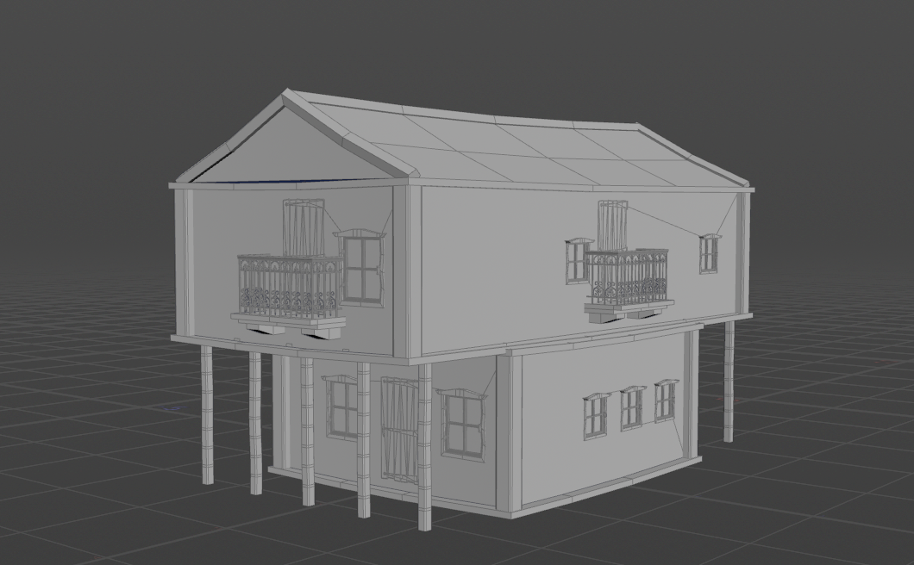
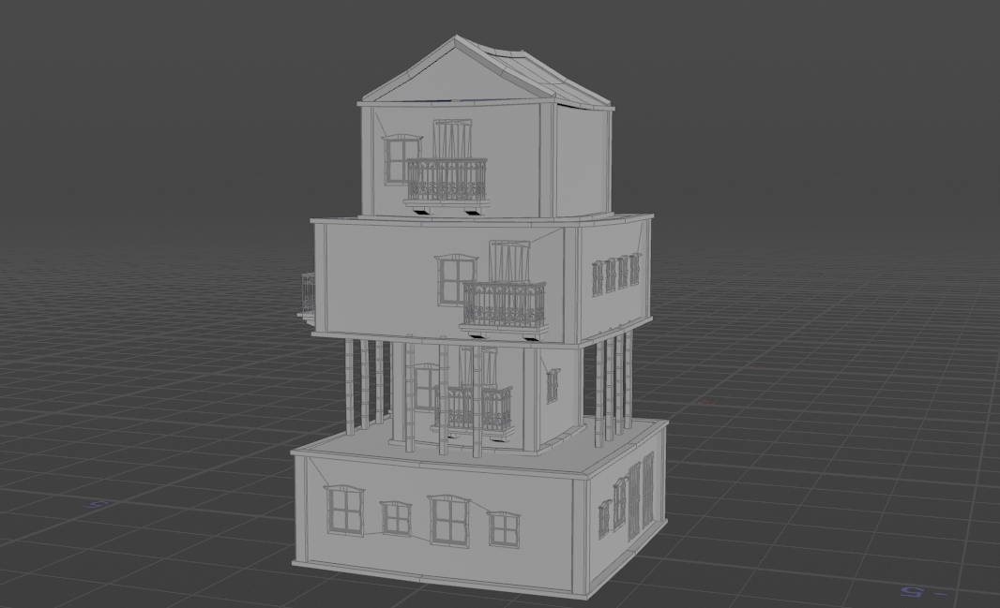
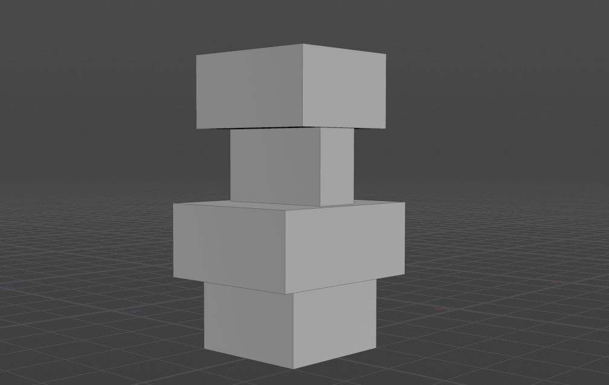
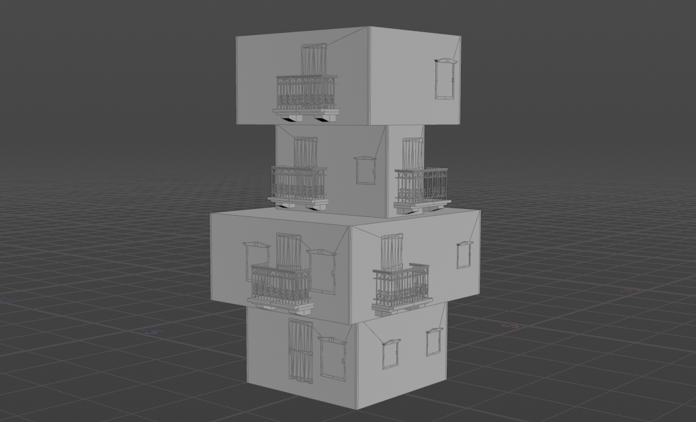
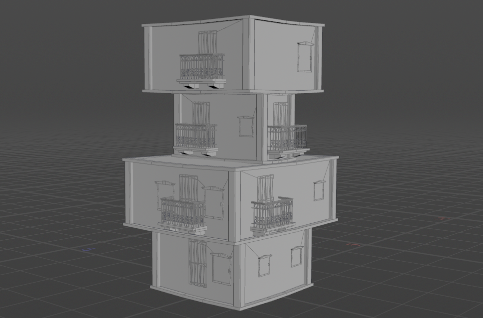
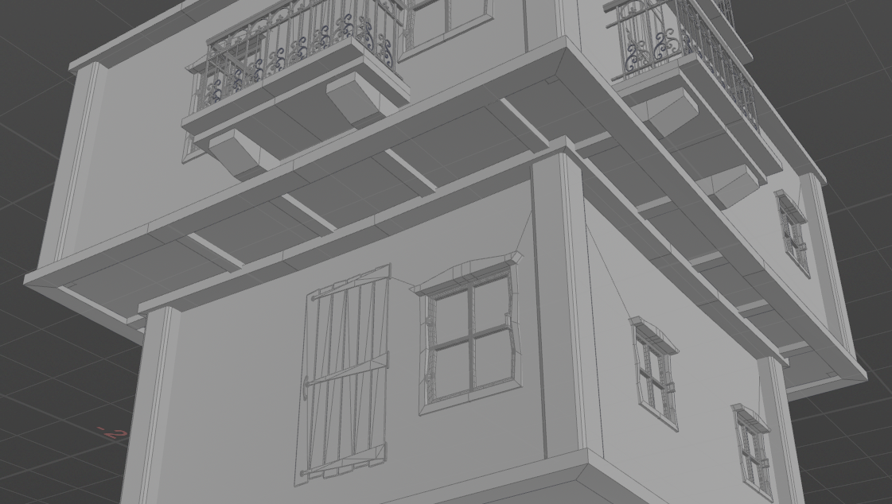
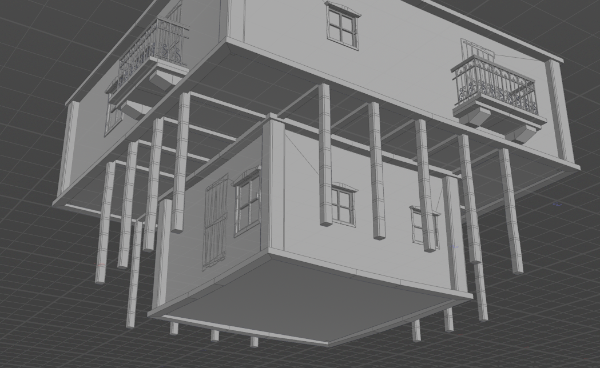
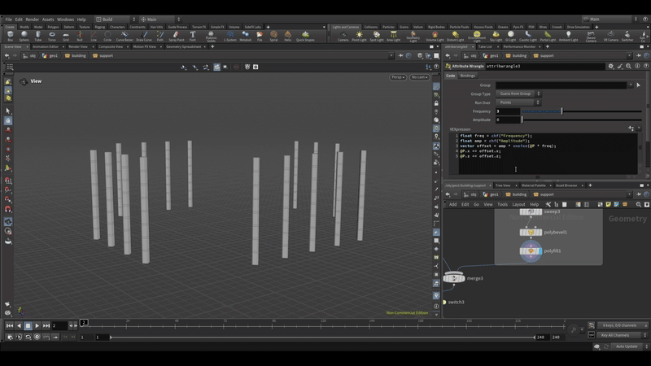
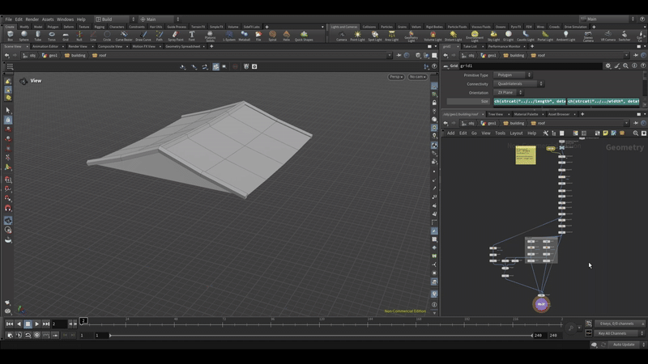

# CIS 5660 HW04 Procedural Buildings

## Demo Video
[Link to demo](https://drive.google.com/file/d/1EyNB3rLCQMwLwRM7QWjuLmMCN_ixBmkG/view?usp=drive_link)

## Project Overview
This project is a Houdini procedural building generator based on the tutorial: https://www.youtube.com/watch?v=uIe97023sDk&t=979s&ab_channel=SimonHoudini  

Here are some results generated:

## Goal
I've been playing Baldur's Gate 3 recently, which inspired me to create DnD-style buildings. The world of Baldur's Gate 3 has an expansive map, and within the city of Baldur's Gate, there are many houses where NPCs live, which must be procedurally generated, as making them all by hand would be overwhelming. Inspired by it, I decided to develop my own procedural building generator in the same style.

|   |  |
|:--:|:--:|
| *Baldur's Gate building* | *Baldur's Gate building* |

|   |  |
|:--:|:--:|
| *DnD-style building* | *Baldur's Gate 3 Screenshot* |

The houses are primarily wooden and can be divided into the following components:

- Ground Floor (Raised Foundation)
    - main structure (walls, doors, windows)
    - support pillars
    - stairs
    - steps

- Upper Floors
    - main structure (walls, doors, windows)

- Roof
    - sloped eaves
    - roof tiles
    - protruding dormer windows

## Features
### Box Stacking
Using a `for each number` loop, with feedback fetching to create box stacking. Users can customize the floor number, as well as length, width and height of each floor.

### Windows, Doors, and Balconies
Using `chain` node to scatter the assets' positions, and `copy to position` node to place the assets. Users can customize the type, size, and height of windows, doors and balconies.

### Pillars, Border and Supports
Adding pillars, border and supports for each floor. Users can turn the pillars on and off.

### Supporting Pillars
I also made supporting pillars based on the supports subnetwork. 

First, I needed to know the height of the pillars, which is the height of the lower floor. 
I used `distance from geometry` to compute the distance between the upper and lower surface of the lower floor. Then, after getting the points on the current floor's edge, I translated them downwards based on the distance, and generate the pillars. 

I added a little dynamics based on noise to make the pillars more interesting.

Users can customize the spacing and offset of the pillars. (demonstrated in the demo video)

### Roof
I add the roof on the top floor. It uses the fetched data from the last iteration of the loop to decide the position, width and height of the roof. User can customize its height.

