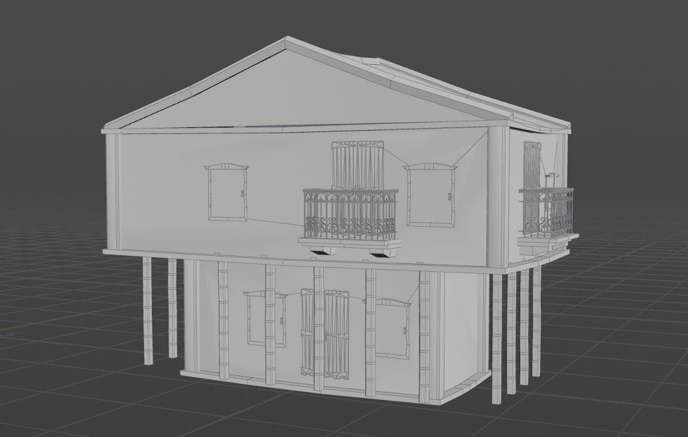
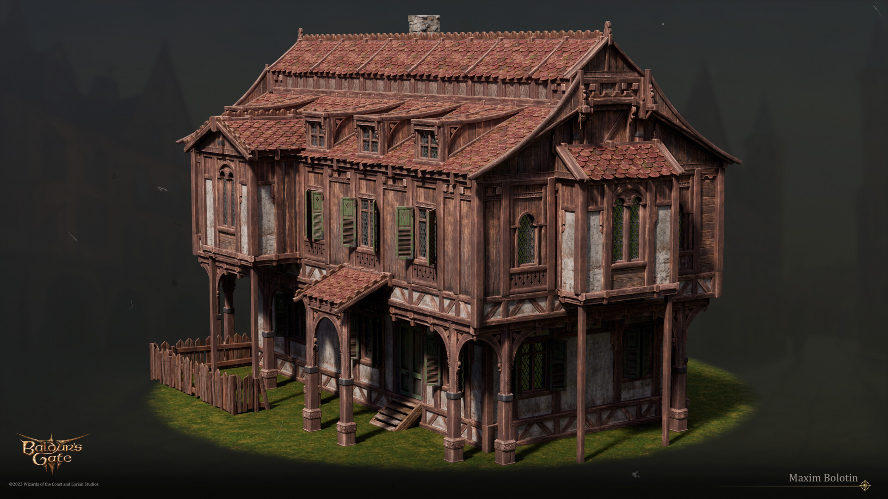
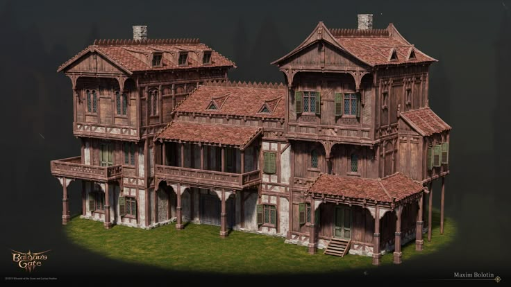
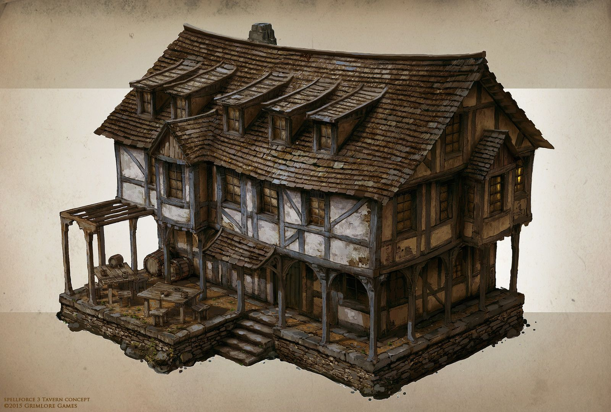
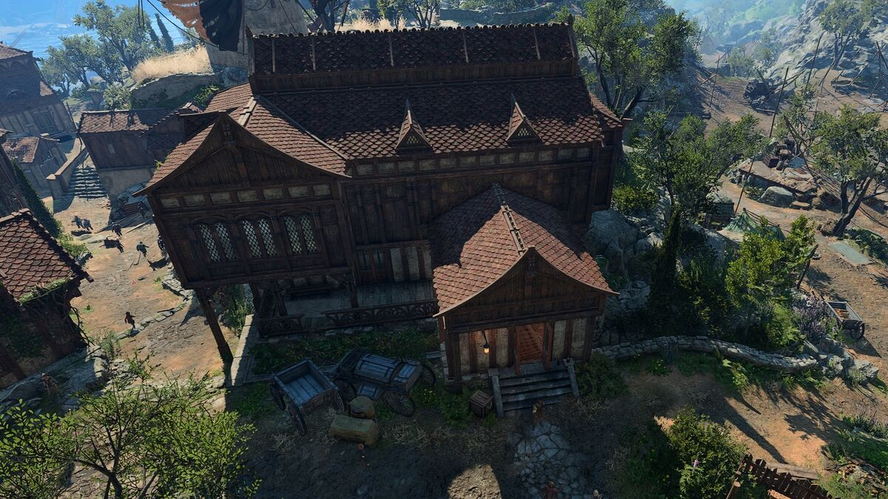

# CIS 5660 HW04 Procedural Buildings

Click the image to watch the video demo!

## Project Overview
This project is a Houdini procedural building generator based on the tutorial: https://www.youtube.com/watch?v=uIe97023sDk&t=979s&ab_channel=SimonHoudini 

## Goal
I've been playing Baldur's Gate 3 recently, which inspired me to create DnD-style buildings. The world of Baldur's Gate 3 has an expansive map, and within the city of Baldur's Gate, there are many houses where NPCs live, which must be procedurally generated, as making them all by hand would be overwhelming. Inspired by it, I decided to develop my own procedural building generator in the same style.

|   |  |
|:--:|:--:|
| *Baldur's Gate building* | *Baldur's Gate building* |

|   |  |
|:--:|:--:|
| *DnD-style building* | *Baldur's Gate 3 Screenshot* |

The houses are primarily wooden and can be divided into the following components:

- Ground Floor (Raised Foundation)
    - main structure (walls, doors, windows)
    - support pillars
    - stairs
    - steps

- Upper Floors
    - main structure (walls, doors, windows)

- Roof
    - sloped eaves
    - roof tiles
    - protruding dormer windows

## Part 1: Box Stacking HDA
First, start by following the tutorial to make a simple HDA that stacks boxes on each other.  Important note about HDA creation:  
Creating an HDA saves a .hda file at the location you specify with the definition of your HDA. Be sure to submit this .hda file along with your .hip file so we can see the contents of your tool.  
Alternatively, when you save your HDA you can choose the “Embedded in HIP File” option (rather than specifying the path), and the hda definition will be automatically embedded in your hip file (and no additional files will be needed with submission).  

## Part 2: Add Details
Next, Simon adds details to the boxes to create floors by refiing the shape and adding details like windows, doors, and balconies.  
Create your own models for windows, doors, and balconies based on your chosen style using Houdini. For each of the three types, create a Null “control” node with parameters that affect your window/door/balcony output (similar to how we made a control node for the jellyfish).  
You should have parameters to drive the width and height of the doors, windows, and balconies, as well as at least one other parameter of your choosing on each one (ex: double vs single doors, windows with and without shutters, and type of balcony railing). Apart from that, you can go as simple or complex as you like!  
Then follow Simon’s setup to integrate your windows, doors, and balconies into your buildings.  
CIS 5660 HW03 Procedural Building 2 

## Part 3: Pillars and Border
Continue following the tutorial to add pillars and borders to each floor. 

## Part 4: Supports
Continue following the tutorial to add supports to floors that overhang other floors.  
(Optional) Extra Credit 
Throughout the tutorial, Simon mentions ways you could extend his project setup. Implement any of his suggestions: 
More complex logic for creating supports (handle different length supports differently) Add more parameters to the user interface (for example, x and z offset options) UV and shade your models 
Add a “manual node” where users can control detail placement manually 
Add additional types of feature models (like fire escapes or chimneys). Note that, depending on what you choose, you might need to add new logic to integrate them into your building (ex: chimneys go on top instead of being chained on the side, fire escapes should be on one side of the building and go all the way down). We’ll award more extra credit accordingly.  
Add some flair to your scene by dressing together multiple buildings or additional procedural props or background elements 
Render your scene 

## Submission
Update your README with 
A description of your project 
A video of your building tool in action 
Create a pull request to this repository 
Submit your Houdini file to Canvas along with a link to your pull request 
IMPORTANT NOTE: make sure your HDA is either embedded in the HIP file or included with your submission (see the instructions under “Part 1: Box Stacking HDA” for additional details).
